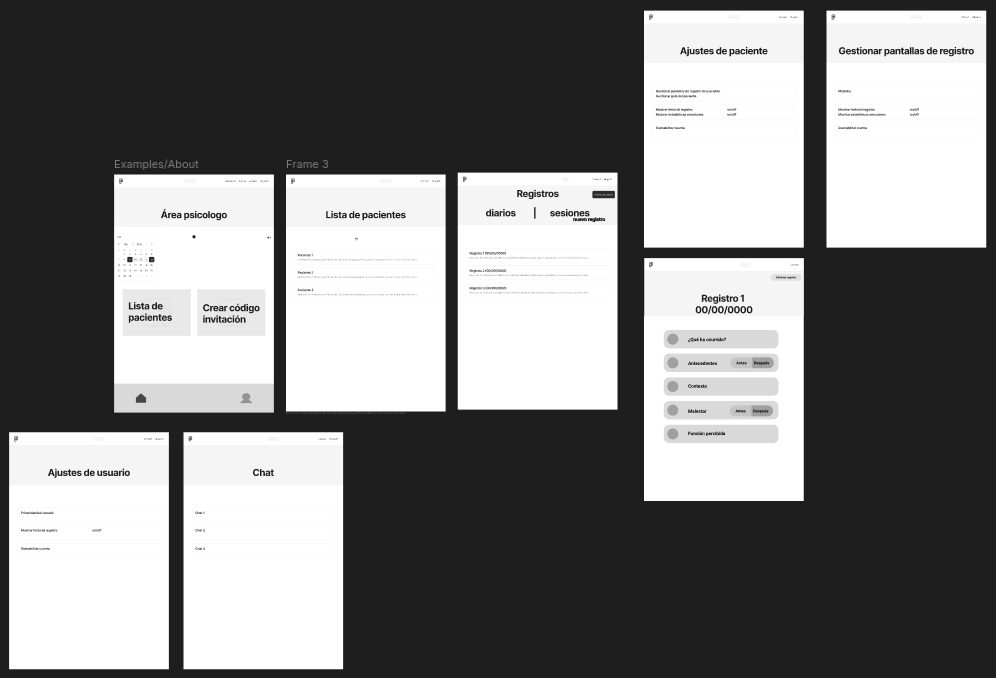
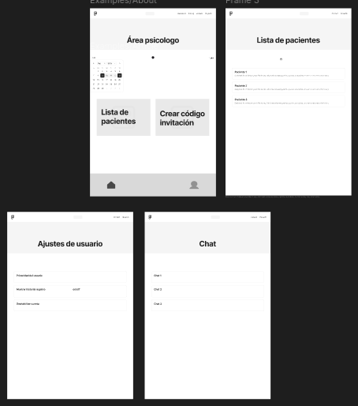
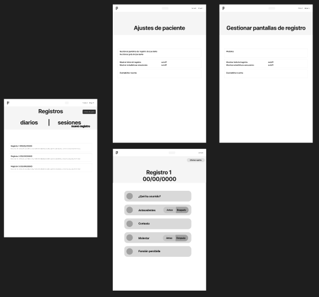
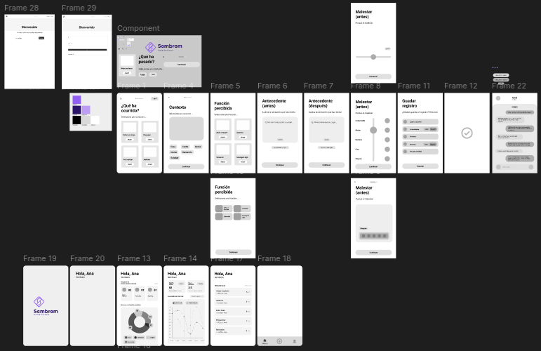
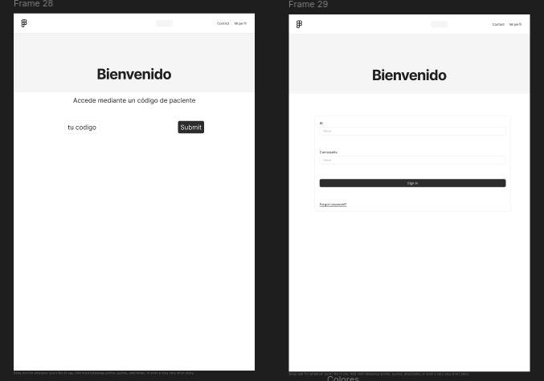
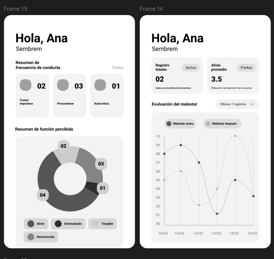
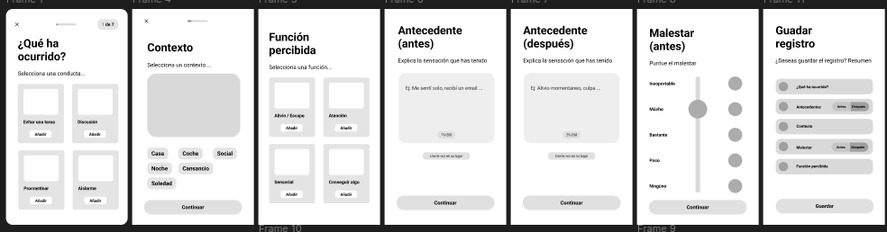
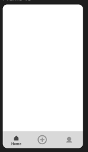

# 2. Diseño

## 2.1. Diagrama de casos de uso

## 2.2. Diseño de la app
### Diseño inicial de la app
Los mockups iniciales que generamos con figma
#### Psicologo

General

Perfil, chat y lista de pacientes

Acceso paciente

#### Pacientes

General

Login

Posibles pantallas incio

Registro

Navbar

## 2.3 Especificacones funcionales (tabla)

Funcionalidad | Prioridad | Descripción
